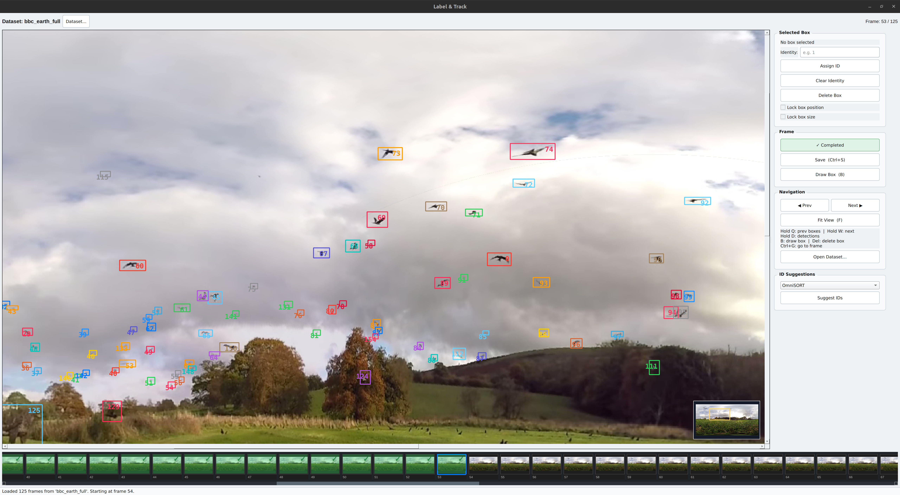
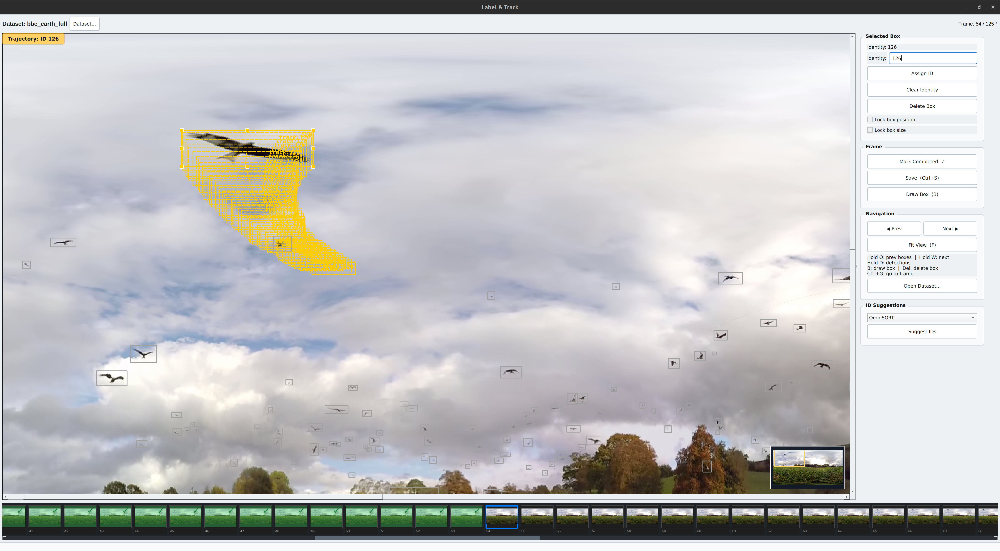

<div align="center">

# Label & Track

**A desktop tool for annotating multi-object tracking datasets — fast, keyboard-driven, and built for precision.**

**Fully implemented by  and **


[](https://python.org)
[](https://pypi.org/project/PyQt5/)
[](LICENSE)
[](https://github.com)

</div>

---

## Why This Exists

Multi-object tracking annotation needs more than drawing boxes. It also needs **consistent identities across long sequences**, quick frame-to-frame comparison, and a workflow that does not slow the annotator down.

**Label & Track** is built for that job. It focuses on fast box editing, identity assignment, frame overlays, and lightweight tracking-based ID suggestions so users can spend time judging labels instead of managing the tool.

---

## Screenshots

<p align="center">
  
  <br/>
  <em>Main interface: canvas with bounding boxes, frame timeline, and annotation sidebar</em>
</p>

<p align="center">
  
  <br/>
  <em>Trajectory overlay — review an object's full history before confirming a tracking ID</em>
</p>

---

## Features

### Annotation
- **Draw, move, resize, copy, and paste boxes** directly on the canvas
- **Assign tracking IDs** with keyboard-first controls
- **Lock box position or size** independently when needed
- **Undo recent edits** on each frame with `Ctrl+Z`

### Smart ID Assignment
- **Same-frame conflict detection** shows when an ID is already in use
- **Past trajectory review** helps check whether an ID belongs to the same object
- **OmniSORT-based ID suggestion** propagates IDs from the previous completed frame

### Navigation & Overlays
- **Frame timeline** with async thumbnail loading and completion indicators
- **Jump to any frame** directly by number (Ctrl+G)
- **Hold Q** to ghost the previous frame's boxes over the current view
- **Hold W** to ghost the next frame's boxes over the current view
- **Hold D** to overlay the raw detector output for the current frame
- **Trajectory overlay** shown automatically when an identity is fully tracked up to the current frame
- **Minimap** appears when zoomed in

### Workflow
- **Mark frame as completed** with `Ctrl+Enter`
- **Dataset switching** with unsaved-change protection
- **Auto-skips to first unlabelled frame** when loading a dataset
- **HUD warning badges** on the canvas for all conflict and overlay states

---

## Installation

**Requirements:** Python 3.8 or newer.

```bash
# 1. Clone the repository
git clone https://github.com/Xin-Shu/FineLabelTool.git
cd FineLabelTool

# 2. (Recommended) Create and activate a virtual environment
python -m venv .venv
source .venv/bin/activate        # macOS / Linux
.venv\Scripts\activate           # Windows

# 3. Install dependencies
pip install -r requirements.txt
```

---

## Running the App

```bash
# Linux / macOS
bash run.sh

# Windows
run.bat

# Or directly
python app/main.py
```

---

## Dataset Structure

Place your datasets inside the `data/` folder. Each dataset is a subfolder with the following layout:

```
data/
└── my_dataset/
    ├── frame/               # Input images — one PNG per frame
    │   ├── 000001.png
    │   ├── 000002.png
    │   └── ...
    ├── label_det/           # (Optional) Detector output — one .txt per frame
    │   ├── 000001.txt
    │   └── ...
    └── label_gt/            # Ground-truth output — created by the app on save
        ├── 000001.txt
        └── ...
```

### Label File Formats

**Detection labels** (`label_det/*.txt`) are read-only input from an external detector:
```
class_id  x_center  y_center  width  height  [confidence]
```
Coordinates are normalised to `[0, 1]`. Confidence is optional.

**Ground-truth labels** (`label_gt/*.txt`) are written by the app on save:
```
identity  x_center  y_center  width  height
```
Only boxes with an assigned identity are saved. Unassigned boxes are discarded at save time.

---

## Keyboard Shortcuts

| Key | Action |
|---|---|
| `←` / `→` | Previous / Next frame |
| `Ctrl+G` | Jump to frame by number |
| `B` | Toggle Draw Box mode |
| `Delete` | Delete selected box |
| `Escape` | Cancel draw mode / deselect box |
| `Ctrl+Z` | Undo last change on current frame |
| `Ctrl+C` | Copy selected box |
| `Ctrl+V` | Paste copied box (works across frames) |
| `Ctrl+S` | Save current frame |
| `Ctrl+Enter` | Toggle frame completion (saves automatically) |
| `F` | Fit image to viewport |
| `Ctrl++` / `Ctrl+-` | Zoom UI in / out |
| `Ctrl+0` | Reset UI zoom |
| `Hold Q` | Overlay previous frame's boxes |
| `Hold W` | Overlay next frame's boxes |
| `Hold D` | Overlay detection boxes |
| `Middle mouse` | Pan the canvas |
| `Scroll wheel` | Zoom canvas in / out |

---

## Annotation Workflow

A typical session looks like this:

1. **Open a dataset** — click *Dataset…* or *Open Dataset…* in the sidebar. The app opens at the first unlabelled frame.
2. **Review detections** — hold `D` to see the detector's raw proposals as a ghost overlay.
3. **Assign IDs** — click a box, enter the identity in the sidebar, and press `Enter` or click *Assign ID*.
   - If the same ID already exists in the frame, the conflict is highlighted.
   - If the ID was previously used by a different object, the past trajectory is shown before confirmation.
4. **Add missing boxes** — press `B` (or click *Draw Box*), drag a rectangle on the canvas, then assign an ID.
5. **Use ID suggestions** — click *Suggest IDs* in the *ID Suggestions* panel to auto-propagate IDs from the previous completed frame using the OmniSORT algorithm.
6. **Compare with adjacent frames** — hold `Q` or `W` to ghost the previous or next frame's boxes over the current view. This helps verify spatial consistency without navigating away.
7. **Mark complete** — press `Ctrl+Enter` when a frame is fully annotated. The frame turns green in the timeline and the labels are saved to `label_gt/`.
8. **Save at any time** — press `Ctrl+S`.

---

## Project Structure

```
FineLabelTool/
├── app/
│   ├── main.py            # Entry point
│   ├── main_window.py     # Application logic and UI orchestration
│   ├── canvas.py          # Interactive image canvas (QGraphicsView)
│   ├── timeline.py        # Thumbnail timeline with async loading
│   ├── label_io.py        # Label file reading and writing
│   ├── colors.py          # Per-identity colour palette
│   └── algo/
│       └── omnisort.py    # GIoU + omni-distance ID suggestion
├── data/                  # Datasets go here
├── requirements.txt
├── run.sh                 # Linux / macOS launcher
└── run.bat                # Windows launcher
```

---

## Contributing

Issues and pull requests are welcome. Please keep the keyboard-first workflow in mind when adding features.

---

## License

MIT License. See [`LICENSE`](LICENSE) for details.
