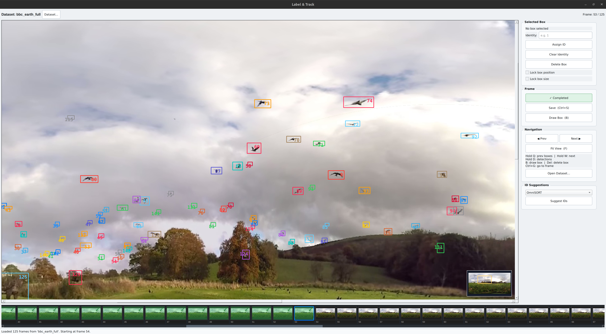
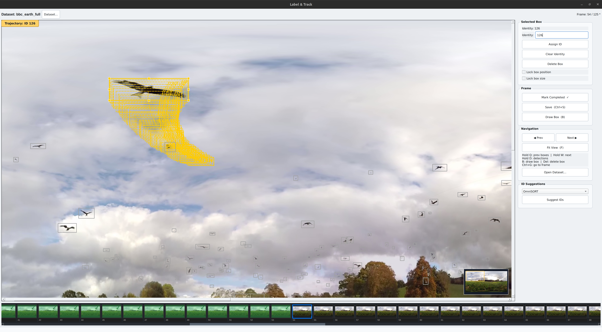

# Label & Track

A desktop PyQt5 tool for annotating image-sequence multi-object tracking datasets.

## Demo

<p align="center">
  
  <br>
  <em>Main annotation interface</em>
</p>

<p align="center">
  
  <br>
  <em>Trajectory overlay for identity review</em>
</p>

## Install

```bash
git clone https://github.com/Xin-Shu/FineLabelTool.git
cd FineLabelTool

python -m venv .venv
source .venv/bin/activate        # Linux / macOS
.venv\Scripts\activate           # Windows

pip install -r requirements.txt
pip install -r requirements-detector.txt   # optional detector assist
```

## Run

```bash
bash run.sh      # Linux / macOS
run.bat          # Windows

# or directly
python app/main.py
```

## Basic Workflow

1. Click `Dataset...` or `Open Dataset...` and choose a dataset folder or frame directory.
2. Draw or edit boxes on the canvas.
3. Assign identities in the sidebar. New IDs start from `1`.
4. Change the image format in the top bar when frames use `jpg`, `jpeg`, `bmp`, etc.
5. Use overlays to compare frames:
   - hold `Q` for previous-frame boxes
   - hold `W` for next-frame boxes
   - hold `D` for detector boxes
6. Use `Suggest IDs` to propagate IDs from the previous completed frame.
7. Use `Suggest Detections` and `Accept New` to add detector proposals.
8. Press `Ctrl+S` to save.
9. Press `Ctrl+Enter` to save and mark the frame completed if sanity checks pass.

The app protects unsaved edits when switching datasets or closing the window.

## Main Controls

- Draw, move, resize, delete, copy, paste, and undo boxes.
- Select all boxes on the current frame with `Ctrl+A`.
- Select several boxes at once: `Shift`-click to add or remove one, or drag with the left button on empty image space to select every box the region touches. Hold `Shift` while dragging to add the region to the current selection. Copy, delete, and `Clear Identity` act on the whole selection.
- Hide in-frame ID numbers while keeping box outlines visible.
- Jump directly to unassigned boxes or disappeared-ID locations from the sidebar.
- Show one trajectory or all trajectories seen up to the current frame.
- Customize shortcuts from the in-app Hotkeys dialog.

## ID And Detection Assist

- `ID Summary` compares the current frame against the previous frame and reports added, disappeared, stayed, and unassigned IDs.
- `Suggest IDs` uses the app's interactive OmniSORT-based matcher to propose IDs from the previous completed frame.
- `Suggest Detections` runs tiled YOLO inference on the current frame and maps detections back to full-frame coordinates.
- `Accept New` adds only detector suggestions that do not overlap existing boxes.
- `Update Detector` fine-tunes YOLO from completed saved labels. After the first model exists, later updates train only on new or changed completed labels.

Detector assist is optional and uses [Ultralytics YOLO](https://docs.ultralytics.com/). GPU acceleration is used when PyTorch detects CUDA or Apple MPS; otherwise the app uses CPU. YOLOX choices are visible in the UI as planned backend options, but the built-in detector workflow currently uses YOLO11 Nano.

## Dataset Layout

Place datasets under `data/`. Each dataset should be one clip folder:

```text
data/
└── my_dataset/
    ├── frame/
    │   ├── img0001.png
    │   ├── img0002.png
    │   └── ...
    ├── label_det/          # optional detector labels
    │   ├── img0001.txt
    │   └── ...
    └── label_gt/           # app-written GT labels
        ├── img0001.txt
        └── ...
```

Large datasets are not versioned. The repository ignores `data/`, detector caches, generated MOT exports, and model weights.

You can also select a frame directory directly from the startup picker. In that mode, the app reads images from the selected directory and writes labels to a sibling `label/` folder, creating it when needed.
The startup picker remembers recently opened directories.

## Label Formats

Detection labels in `label_det/*.txt`:

```text
class_id  x_center  y_center  width  height  [confidence]
```

Ground-truth labels in `label_gt/*.txt`:

```text
identity  x_center  y_center  width  height
```

Both app-native formats use normalized `[0, 1]` center coordinates. Only boxes with assigned identities are saved to `label_gt`.

MOT exports use:

```text
frame,id,x1,y1,w,h,conf,-1,-1,-1
```

MOT frame numbers and IDs are 1-based. MOT boxes use pixel upper-left `x1,y1,width,height`.

## Shortcuts

| Key | Action |
|---|---|
| `Left` / `Right` | Previous / next frame |
| `Ctrl+G` | Jump to frame |
| `B` | Draw box |
| `Delete` | Delete selected boxes |
| `Escape` | Cancel draw mode / deselect |
| `Ctrl+A` | Select all boxes on current frame |
| `Ctrl+Z` | Undo current-frame edit |
| `Ctrl+C` / `Ctrl+V` | Copy / paste boxes across frames |
| `Ctrl+S` | Save current frame |
| `Ctrl+Enter` | Save and attempt completion |
| `F` | Fit image to view |
| `Ctrl++` / `Ctrl+-` / `Ctrl+0` | UI zoom in / out / reset |
| Hold `Q` / `W` / `D` | Overlay previous / next / detector boxes |
| Middle mouse | Pan while zoomed |
| Scroll wheel | Canvas zoom |
